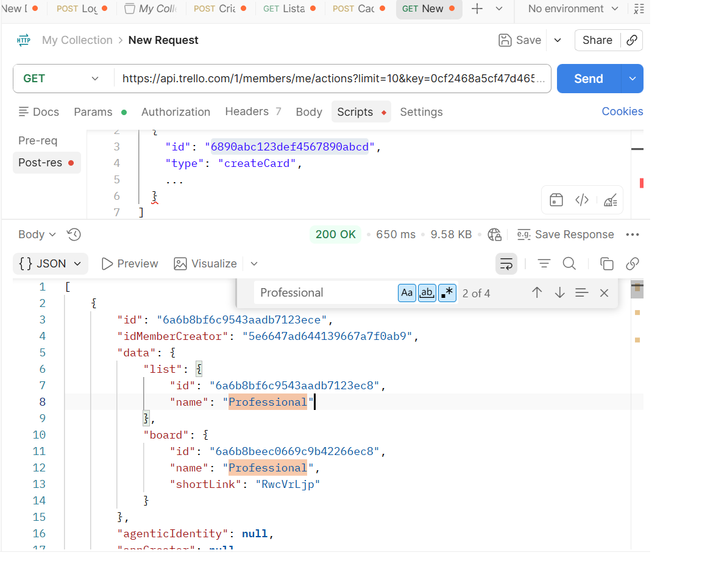
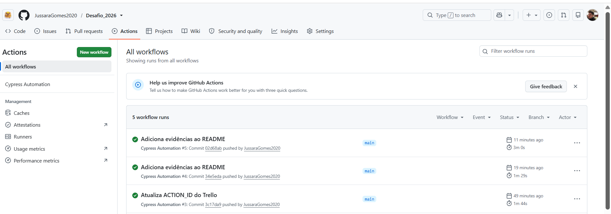

# Desafio Técnico QA – Automação Web e API com Cypress

## Sobre o projeto

Este projeto foi desenvolvido como parte de um desafio técnico para demonstrar conhecimentos em automação de testes Web e API utilizando **Cypress**.

A solução contempla:

- Automação de testes funcionais Web utilizando **Cypress**, **Cucumber** e **Page Object Model (POM)**;
- Automação de um teste de API utilizando o comando `cy.request()`;
- Organização da suíte para facilitar manutenção e evolução dos testes.

Durante o desenvolvimento procurei manter a separação entre a lógica dos testes, os elementos das páginas e os dados utilizados na automação, deixando cada responsabilidade em um único lugar.

---

# Tecnologias utilizadas

- JavaScript (ES6+)
- Cypress
- Cucumber
- Node.js
- npm
- Git
- GitHub
- GitHub Actions

---

# Ambiente utilizado

| Tecnologia | Versão |
|------------|---------|
| Node.js | 24.18.0 |
| npm | 11.16.0 |
| Cypress | 15.19.0 |

---

# Organização do projeto

A estrutura foi organizada separando os testes Web dos testes de API.

Nos testes Web utilizei **Page Object Model**, concentrando os seletores e ações das páginas em classes específicas para evitar repetição de código.

Os cenários foram escritos em **Gherkin** utilizando **Cucumber**, deixando a leitura mais próxima do fluxo funcional.

Os testes de API utilizam o próprio recurso nativo do Cypress (`cy.request()`), sem necessidade de bibliotecas adicionais.

```
DESAFIO_CYPRESS
│
├── .github
│   └── workflows
│
├── cypress
│   ├── e2e
│   │   ├── api
│   │   ├── cadastrar_usuario
│   │   ├── carrinho
│   │   ├── checkout
│   │   ├── login
│   │   └── produtos
│   │
│   ├── fixtures
│   ├── pages
│   ├── support
│   └── utils
│
├── evidencias
│
├── package.json
├── cypress.config.js
└── README.md
```

---

# Pré-requisitos

- Node.js
- npm
- Git

---

# Instalação

Clone o repositório:

```bash
git clone https://github.com/JussaraGomes2020/Desafio_2026.git
```

Entre na pasta do projeto:

```bash
cd Desafio_2026
```

Instale as dependências:

```bash
npm install
```

---

# Configuração da API

Para executar o teste de API é necessário criar um arquivo chamado:

```text
cypress.env.json
```

com as credenciais do Trello:

```json
{
  "TRELLO_KEY": "SUA_KEY",
  "TRELLO_TOKEN": "SEU_TOKEN",
  "TRELLO_ACTION_ID": "SEU_ACTION_ID"
}
```

Esse arquivo não faz parte do repositório e está listado no `.gitignore`.

---

# Execução dos testes

Abrir o Cypress:

```bash
npm run cy:open
```

Executar toda a suíte:

```bash
npm run cy:run
```

Executar apenas os testes Web:

```bash
npm run test:web
```

Executar apenas o teste de API:

```bash
npm run test:api
```

---

# Cenários automatizados

## Web

Foram automatizados os seguintes fluxos da aplicação:

- Login
- Cadastro de usuário
- Produtos
- Carrinho
- Checkout

Todos os cenários foram escritos em Gherkin e implementados utilizando Cucumber.

---

## API

Foi automatizado um teste utilizando a API pública do Trello.

Endpoint utilizado:

```http
GET /1/actions/{actionId}
```

A autenticação é realizada através de **key** e **token**, enviados como parâmetros da requisição.

Durante o teste são realizadas as seguintes validações:

- Status Code 200;
- Estrutura da resposta;
- Campo `data.list.name`;
- Valor esperado: `Professional`.

Também é registrado no log o nome da lista retornada pela API.

---

# Decisões de implementação

Durante o desenvolvimento optei por algumas decisões para deixar o projeto mais organizado:

- Separação entre testes Web e API;
- Utilização de Page Object Model nos testes Web;
- Centralização dos endpoints da API;
- Uso de variáveis de ambiente para armazenar credenciais;
- Scripts separados para execução da suíte completa, apenas Web e apenas API;
- Organização das funcionalidades em diretórios independentes.

---

# Evidências

Antes da automação da API foi realizada uma validação manual utilizando o Postman para confirmar o comportamento esperado do endpoint.

### Validação da API



### Pipeline

O projeto também possui uma pipeline de execução utilizando GitHub Actions.



---

# Possíveis evoluções

Caso o projeto continuasse sendo desenvolvido, alguns próximos passos seriam:

- ampliar a cobertura dos testes de API;
- adicionar relatórios utilizando Allure;
- executar testes em paralelo;
- integrar ferramentas de análise de qualidade, como SonarQube.

---

# Sobre o uso de IA

Durante o desenvolvimento utilizei o ChatGPT como apoio para pesquisa, revisão de código e discussão de alternativas de implementação.

As sugestões foram analisadas e adaptadas ao contexto do desafio. Sempre que necessário, realizei ajustes na implementação para atender aos requisitos da aplicação e validar o comportamento esperado.

---

# Autor

**Jussara Gomes**

Profissional de Qualidade de Software (QA) com experiência em testes manuais e automatizados.

Este projeto foi desenvolvido como parte de um desafio técnico para demonstrar conhecimentos em automação de testes Web e API utilizando Cypress.